# Kubernetes Homelab with GitOps Pipeline

> Production-grade Kubernetes cluster with distributed storage, secrets management, complete CI/CD pipeline, automated GitOps deployments, and comprehensive monitoring - built and documented from scratch on a Proxmox homelab.

## 📊 Project Highlights

- **Complete GitOps Pipeline** - Git push to production in ~5 minutes with zero manual intervention
- **PostgreSQL High Availability** - CloudNativePG operator with automatic failover (<10 sec downtime)
- **Dynamic Secrets Management** - HashiCorp Vault with Kubernetes authentication for secure credential handling
- **Distributed Block Storage** - Longhorn with 3-way replication across cluster nodes
- **Production-Grade Observability** - Custom Prometheus metrics with Grafana dashboards
- **High Availability Everything** - 8-pod app + 2-instance PostgreSQL + 3-pod Vault cluster
- **Self-Hosted Infrastructure** - Private registry, self-hosted CI/CD runner, no cloud dependencies
- **Vault Kubernetes Auth** - Pods authenticate to Vault using ServiceAccount tokens (no hardcoded credentials)

## 🏗️ Architecture

```mermaid
flowchart LR
    %% Styling
    classDef external fill:#24292e,stroke:#fff,stroke-width:2px,color:#fff
    classDef infra fill:#0ea5e9,stroke:#fff,stroke-width:2px,color:#fff
    classDef control fill:#8b5cf6,stroke:#fff,stroke-width:2px,color:#fff
    classDef worker fill:#10b981,stroke:#fff,stroke-width:2px,color:#fff

    %% Nodes
    GH[GitHub]
    class GH external

    subgraph CICD[CI/CD Infrastructure]
        REG[Docker Registry]
        RUNNER[GitHub Runner]
    end
    class REG,RUNNER infra

    subgraph CLUSTER[K3s Cluster]
        subgraph CP[Control Plane]
            ARGO[ArgoCD]
            VAULT[Vault HA]
            MON[Prometheus<br/>Grafana]
        end
        
        subgraph WORKERS[Worker Nodes]
            APPS[Demo Apps<br/>8 Pods]
            STORAGE[Longhorn<br/>Storage]
        end
    end
    class ARGO,VAULT,MON control
    class APPS,STORAGE worker

    %% Flows
    GH -->|1. Push| RUNNER
    RUNNER -->|2. Build| REG
    RUNNER -.->|3. Update| GH
    GH -->|4. Sync| ARGO
    ARGO ==>|5. Deploy| APPS
    REG -.->|Pull| APPS
    APPS -.->|Metrics| MON
    VAULT -.->|Secrets| APPS
    APPS --> STORAGE
```

### Core Components

**External:** GitHub (source of truth)  
**CI/CD:** Docker Registry + Self-hosted GitHub Runner  
**Control Plane:** ArgoCD (GitOps), Vault (secrets), Prometheus/Grafana (monitoring)  
**Workers:** 8 FastAPI pods distributed across 2 nodes with Longhorn storage

### Pipeline Flow

1. **Push** code to GitHub
2. **Build** Docker image via self-hosted runner
3. **Update** deployment manifest with new image tag
4. **Sync** - ArgoCD detects changes every ~3 minutes
5. **Deploy** - Rolling update across worker nodes

### Infrastructure Details

| Component | Nodes | Description |
|-----------|-------|-------------|
| **K3s Cluster** | 3 nodes (1 control, 2 workers) | Lightweight Kubernetes distribution |
| **Longhorn** | Distributed storage | 3-way replication, ~100GB usable capacity |
| **Vault** | 3 pods (HA) | Secrets management with Raft consensus, Kubernetes auth enabled |
| **PostgreSQL** | 2 instances (HA) | CloudNativePG operator, automatic failover |
| **Demo App** | 8 pods | FastAPI with Prometheus metrics |
| **Monitoring** | Prometheus + Grafana | 7-day metrics retention |
| **GitOps** | ArgoCD | Continuous deployment automation |

## ✨ Key Features

### PostgreSQL High Availability
- **CloudNativePG Operator** for automated PostgreSQL management
- **2 instances** (1 Primary + 1 Replica) with streaming replication
- **Automatic failover** (~5-10 seconds downtime)
- **3 Services** automatically created (read-write, read-only, read)
- **Longhorn storage** per instance with 3-way replication
- **Prometheus metrics** integration for monitoring
- **Production-grade** configuration with resource limits and health checks

### Vault Kubernetes Authentication
- **ServiceAccount-based authentication** - pods authenticate without hardcoded tokens
- **K3s 1.21+ compatible** - configured for new token format with proper audience handling
- **Fine-grained policies** - namespace and path-level access control
- **Token TTL** - automatic expiration for security (1h default, 24h max)
- **Production-ready** - foundation for dynamic database secrets

### Secrets Management
- **HashiCorp Vault** in HA mode (3 pods with Raft consensus)
- Encrypted secrets storage with Shamir secret sharing (5 keys, threshold 3)
- Web UI for management and monitoring
- Persistent storage via Longhorn (15GB replicated)
- Kubernetes authentication method configured
- Manual unsealing workflow for enhanced security

### Distributed Storage
- **Longhorn** distributed block storage
- 3-way replication across all cluster nodes
- Automatic volume provisioning via StorageClass
- Web UI for volume management and monitoring
- High availability for stateful workloads
- ~100GB usable capacity (300GB raw with replication)

### GitOps Workflow
- **ArgoCD** continuously monitors Git repository
- Automatic deployment on manifest changes (~3 minute sync interval)
- Self-healing - cluster state always matches Git
- Automatic rollback on failed deployments
- Complete audit trail in Git history

### CI/CD Pipeline
- **GitHub Actions** with self-hosted runner
- Automated Docker builds on every commit
- SHA-based image tagging for traceability
- Automatic manifest updates triggering ArgoCD sync
- Built-in loop prevention (`[skip ci]` + paths-ignore)
- Private registry integration (no external dependencies)

### High Availability Infrastructure
- **3-node K3s cluster** on Proxmox VMs
- **Pod anti-affinity** rules spreading workloads across nodes
- **Zero-downtime deployments** via rolling updates (maxSurge/maxUnavailable: 1)
- **Health probes** for liveness and readiness
- **Resource limits** enforced per pod

### Monitoring & Observability
- **Prometheus** for metrics collection (7-day retention)
- **Grafana** dashboards for visualization
- **Application metrics** via FastAPI Prometheus instrumentation
- **Database metrics** via CloudNativePG PodMonitor
- **Pre-built dashboards** for cluster, apps, and database monitoring
- **ServiceMonitor** for automatic target discovery

## 🛠️ Tech Stack

### Infrastructure & Orchestration

### Storage & Secrets

### Database & Operators

### CI/CD & GitOps

### Monitoring & Observability

### Application

### Tools

## 📚 Documentation

Complete step-by-step documentation covering the entire build process, including challenges faced and solutions implemented:

| Document | Description |
|----------|-------------|
| [**01 - Infrastructure Setup**](docs/01-infrastructure-setup.md) | Proxmox VMs, K3s cluster installation, LXC vs VM decision |
| [**02 - Docker Registry**](docs/02-docker-registry.md) | Private registry setup and self-hosted GitHub Actions runner |
| [**03 - CI/CD Pipeline**](docs/03-github-actions-pipeline.md) | GitHub Actions workflow, image building, manifest updates, loop prevention |
| [**04 - GitOps with ArgoCD**](docs/04-argocd-gitops.md) | ArgoCD installation, application setup, automated deployments |
| [**05 - Monitoring Stack**](docs/05-monitoring-stack.md) | Prometheus & Grafana installation, custom metrics, dashboards |
| [**06 - Longhorn Storage**](docs/06-longhorn-storage.md) | Distributed block storage, replication, persistent volumes |
| [**07 - Vault Setup**](docs/07-vault-setup.md) | HashiCorp Vault HA setup, initialization, unsealing process |
| [**08 - Vault Kubernetes Auth**](docs/08-vault-kubernetes-auth.md) | Kubernetes authentication, policies, ServiceAccount integration |
| [**09 - PostgreSQL HA**](docs/09-postgresql-ha.md) | CloudNativePG operator, HA cluster, automatic failover, StatefulSet lessons learned |
| [**10 - Vault Database Secrets**](docs/10-vault-db-secrets.md) | Dynamic PostgreSQL credentials with automatic rotation |

## 🚀 Quick Start

### Prerequisites
- Proxmox VE host
- Basic understanding of Kubernetes concepts
- GitHub account for CI/CD

### Deployment Overview

1. **Set up infrastructure** - Create VMs from template, install K3s
2. **Configure storage** - Deploy Longhorn for distributed persistent storage
3. **Configure registry** - Deploy private Docker registry with authentication
4. **Install secrets management** - Set up HashiCorp Vault in HA mode
5. **Configure Vault Kubernetes Auth** - Enable pod authentication to Vault
6. **Deploy PostgreSQL HA** - CloudNativePG operator with automatic failover
7. **Install GitOps** - Set up ArgoCD for automated deployments
8. **Deploy monitoring** - Install Prometheus & Grafana via Helm
9. **Configure CI/CD** - Set up GitHub Actions with self-hosted runner

Detailed instructions available in the [documentation](docs/).

## 📈 Metrics & Monitoring

### Cluster Resources
- **3 nodes** (1 control plane, 2 workers)
- **12 vCPUs** total across cluster
- **16GB RAM** total
- **300GB storage** across nodes (100GB per VM)

### Storage Architecture
- **Longhorn** distributed block storage
- **3-way replication** for high availability
- **~100GB usable capacity** with replication overhead
- **Automatic volume provisioning** via StorageClass
- **15GB** for Vault data (replicated)
- **10GB** for PostgreSQL data (replicated)

### Application Deployment
- **8 pod replicas** for high availability
- **Rolling updates** with max surge/unavailable of 1
- **Resource limits** enforced (128Mi memory, 200m CPU per pod)
- **Health probes** for liveness and readiness
- **Pod anti-affinity** spreading pods across nodes

### Secrets Management
- **Vault HA cluster** (3 pods with Raft storage)
- **15GB replicated storage** for Vault data
- **Shamir secret sharing** (5 keys, threshold 3)
- **Manual unsealing** workflow for security
- **Kubernetes Auth** configured for ServiceAccount-based pod authentication
- **Dynamic secrets** ready for PostgreSQL credential generation

### Database Layer
- **PostgreSQL HA cluster** (2 instances with CloudNativePG)
- **Automatic failover** (~5-10 seconds downtime)
- **Streaming replication** between Primary and Replica
- **10GB replicated storage** (5GB per instance)
- **3 Services** for read-write, read-only, and read operations
- **Prometheus metrics** via PodMonitor

### Monitoring Coverage
- **7 days** metric retention
- **30 second** scrape interval
- **Custom application metrics** via Prometheus instrumentation
- **PostgreSQL metrics** via CloudNativePG PodMonitor
- **Pre-built Grafana dashboards** for cluster, apps, and database

## 🔧 Key Technical Decisions

### Why Longhorn?
Provides Kubernetes-native distributed block storage with automatic replication, perfect for homelab scale while demonstrating production patterns. Simpler than Ceph but more robust than NFS. Essential for stateful workloads like Vault and PostgreSQL.

### Why Vault?
Industry-standard secrets management that demonstrates enterprise-grade security practices. Vault's Kubernetes authentication, dynamic secrets, and audit logging are critical for production Kubernetes deployments. Shows understanding of proper credential management.

### Why CloudNativePG?
Modern PostgreSQL operator that abstracts the complexity of streaming replication, automatic failover, and connection pooling. Demonstrates understanding of the Operator pattern and stateful workload management. Much simpler than manual Patroni setup.

### Why K3s?
Lightweight Kubernetes distribution perfect for homelab environments while maintaining production-grade features. Reduced resource footprint allows running full HA setup on limited hardware.

### Why Private Registry?
- Faster image pulls (no internet dependency)
- Complete control over images
- No rate limits
- Privacy for development
- Demonstrates understanding of enterprise container workflows

### Why Self-Hosted Runner?
- Direct access to private registry (no firewall complexity)
- Outbound-only connections for security
- Local network speeds
- No external dependencies
- More realistic enterprise pattern than cloud-hosted runners

### Why GitOps?
- Git as single source of truth
- Automated deployments with complete audit trail
- Easy rollbacks (just revert commit)
- Configuration drift prevention
- Industry-standard deployment pattern

### Why 2 PostgreSQL Instances Instead of 3?
Resource constraints (4GB worker nodes) while still demonstrating HA concepts. 1 Primary + 1 Replica provides automatic failover and read scaling. In production with more RAM, would use 3+ instances.

## 🎓 What I Learned

### Core Kubernetes Concepts
- **Operator Pattern** - How Custom Resource Definitions (CRDs) extend Kubernetes API
- **StatefulSet vs Replication** - Why `replicas: 2` doesn't equal database replication
- **Storage Architecture** - PV, PVC, StorageClass relationship and dynamic provisioning
- **Pod Scheduling** - Affinity rules, node selection, resource constraints
- **Service Discovery** - ClusterIP, NodePort, Ingress patterns
- **RBAC** - Roles, RoleBindings, ServiceAccounts for least-privilege access

### PostgreSQL High Availability
- **CloudNativePG Operator** - Automated PostgreSQL lifecycle management
- **Streaming Replication** - How WAL logs are replicated between instances
- **Automatic Failover** - Leader election and promotion process (~5-10 seconds)
- **Connection Pooling** - Read-write vs read-only service separation
- **Backup Strategies** - Point-in-time recovery considerations

### Secrets Management
- **Vault's Security Model** - Sealed state, unsealing process, root tokens
- **Shamir Secret Sharing** - 5 keys with threshold 3 for high availability
- **Kubernetes Auth** - ServiceAccount tokens, audience claims, K3s-specific config
- **Dynamic Secrets** - Credential generation with TTL and automatic cleanup
- **Policy Design** - Least-privilege access control per namespace/path

### Distributed Systems
- **Raft Consensus** - How distributed systems achieve consistency
- **Leader Election** - Failover mechanisms in Vault and PostgreSQL
- **Replication Strategies** - Application-level (PostgreSQL) vs storage-level (Longhorn)
- **CAP Theorem Trade-offs** - Consistency vs availability in distributed storage

### Infrastructure as Code
- **GitOps Principles** - Declarative configuration in Git
- **Pipeline Design** - Avoiding infinite loops, artifact management
- **Immutable Infrastructure** - SHA-based image tags for traceability

### Monitoring & Observability
- **Metrics Collection** - Prometheus scraping, ServiceMonitor CRDs
- **Instrumentation** - Adding custom metrics to applications
- **Visualization** - Building Grafana dashboards for different audiences
- **Alerting Patterns** - (foundation laid for future implementation)

### Problem-Solving
- **Disk I/O Errors** - Learning to drain nodes before disk operations
- **ServiceMonitor Discovery** - Importance of label matching and port names
- **Audience Errors** - K3s 1.21+ token format changes
- **Registry Authentication** - GitHub Secrets for credential management
- **Infinite Loops** - `[skip ci]` and paths-ignore in CI/CD

### Production vs Homelab
- **Security Trade-offs** - Manual unsealing vs auto-unseal with KMS
- **TLS Decisions** - HTTP for simplicity vs cert-manager in production
- **Resource Sizing** - Balancing HA with hardware constraints
- **Monitoring Scope** - 7-day retention vs long-term storage needs

## 🔗 Service URLs

| Service | URL | Purpose |
|---------|-----|---------|
| **ArgoCD UI** | `https://10.0.0.2:30670` | GitOps deployment management |
| **Prometheus** | `http://10.0.0.2:30090` | Metrics collection and queries |
| **Grafana** | `http://10.0.0.2:30030` | Metrics visualization dashboards |
| **Vault UI** | `http://10.0.0.2:30820` | Secrets management interface |
| **Longhorn UI** | `http://10.0.0.2:30880` | Storage volume management |

*Note: These are internal homelab IPs. In production, these would be behind proper ingress with TLS.*

## 🚧 Current Focus & Next Steps

**Currently implementing:**
- 🔄 **Vault Database Secrets Engine** - Dynamic PostgreSQL credentials with 1h TTL and automatic rotation
- 🔄 **Infrastructure as Code** - Terraform for Proxmox VM provisioning + Ansible for K3s configuration

**Planned enhancements:**
- **Production Applications** - Migrate Wiki.js from LXC to Kubernetes with Vault-managed credentials
- **Vault Agent Injector** - Automatically inject secrets into pods at runtime without code changes
- **Backup Strategy** - CloudNativePG backups to S3-compatible storage or Longhorn snapshots
- **Logging Stack** - Add Loki for centralized log aggregation and correlation with metrics
- **Service Mesh** - Istio or Linkerd for advanced traffic management and mTLS between services
- **Multi-Environment** - Separate dev/staging/prod namespaces with ArgoCD ApplicationSets
- **TLS Everywhere** - cert-manager with Let's Encrypt for all services
- **Network Policies** - Restrict pod-to-pod communication for defense in depth

## 📝 Notes

**Security Considerations:**
- This project uses example credentials for documentation purposes
- All sensitive credentials are managed via GitHub Secrets in CI/CD workflows
- Vault unseal keys are stored securely outside the cluster
- When replicating this setup, replace all placeholder values with your own secure credentials

**Homelab Simplifications:**
- HTTP instead of HTTPS (TLS would be enabled with cert-manager in production)
- Manual Vault unsealing (production would use cloud KMS auto-unseal)
- Private network IPs (production would use proper DNS and load balancers)
- 4GB worker nodes (production would have more resources for additional replicas)

**Portfolio Purpose:**
Built to demonstrate production-grade DevOps skills including Kubernetes, GitOps, secrets management, high availability, and infrastructure automation for job applications in DevOps/Platform Engineering roles.

## 📄 License

This project is licensed under the MIT License - see the [LICENSE](LICENSE) file for details.

Feel free to use this project, documentation, and configurations to your liking. Just make sure to replace any personal data (names, locations, contact information) with your own!

---

## 👤 About

**Author:** Maximilian  
**Role:** DevOps Engineer / Platform Engineer (seeking position)  
**Location:** Munich/Freising Area, Germany  
**Focus:** Kubernetes, GitOps, Infrastructure Automation, Site Reliability Engineering  

Built as a portfolio project to demonstrate production-grade DevOps and Platform Engineering skills. The project showcases end-to-end infrastructure automation, from bare metal to application deployment, with enterprise patterns like GitOps, secrets management, high availability, and comprehensive observability.

**Built with** ☕ **and extensive troubleshooting**
