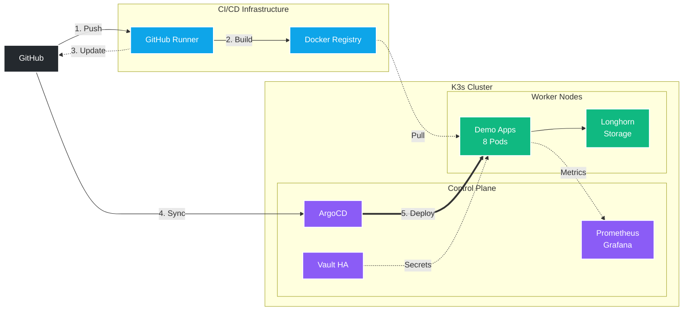

# Kubernetes Homelab with GitOps Pipeline

> Production-grade Kubernetes cluster with distributed storage, secrets management, complete CI/CD pipeline, automated GitOps deployments, and comprehensive monitoring - built and documented from scratch on a Proxmox homelab.

## 📊 Project Highlights

- **Enterprise Secrets Management** - HashiCorp Vault with HA Raft storage for secure credential handling
- **Distributed Block Storage** - Longhorn with 3-way replication across cluster nodes
- **Fully Automated Deployments** - Git push to production in ~5 minutes
- **High Availability** - 8-pod deployment with anti-affinity rules and persistent storage
- **Complete Observability** - Custom Prometheus metrics with Grafana dashboards
- **Self-Hosted Infrastructure** - Private registry, self-hosted CI/CD runner, all local
- **Production Patterns** - Rolling updates, health checks, resource limits, GitOps workflow

## 🏗️ Architecture

### Core Components

**External:** GitHub (source of truth)  
**CI/CD:** Docker Registry + Self-hosted GitHub Runner  
**Control Plane:** ArgoCD (GitOps), Vault (secrets), Prometheus/Grafana (monitoring)  
**Workers:** 8 FastAPI pods distributed across 2 nodes with Longhorn storage

### Pipeline Flow

1. **Push** code to GitHub
2. **Build** Docker image via self-hosted runner
3. **Update** deployment manifest with new image tag
4. **Sync** - ArgoCD detects changes every ~3 minutes
5. **Deploy** - Rolling update across worker nodes

### Infrastructure Details

| Component | Nodes | Description |
|-----------|-------|-------------|
| **K3s Cluster** | 3 nodes (1 control, 2 workers) | Lightweight Kubernetes distribution |
| **Longhorn** | Distributed storage | 3-way replication, ~100GB usable capacity |
| **Vault** | 3 pods (HA) | Secrets management with Raft consensus |
| **Demo App** | 8 pods | FastAPI with Prometheus metrics |
| **Monitoring** | Prometheus + Grafana | 7-day metrics retention |
| **GitOps** | ArgoCD | Continuous deployment automation |

## ✨ Key Features

### Secrets Management
- **HashiCorp Vault** in HA mode (3 pods with Raft consensus)
- Encrypted secrets storage with Shamir secret sharing
- Web UI for management and monitoring
- Persistent storage via Longhorn
- Ready for dynamic database credentials and Kubernetes auth

### Distributed Storage
- **Longhorn** distributed block storage
- 3-way replication across all cluster nodes
- Automatic volume provisioning via StorageClass
- Web UI for volume management and monitoring
- High availability for stateful workloads

### GitOps Workflow
- **ArgoCD** continuously monitors Git repository
- Automatic deployment on manifest changes
- Self-healing - cluster state always matches Git
- ~3 minute sync interval

### CI/CD Pipeline
- **GitHub Actions** with self-hosted runner
- Automated Docker builds on every commit
- SHA-based image tagging for traceability
- Automatic manifest updates
- Built-in loop prevention (`[skip ci]`)

### Infrastructure
- **3-node K3s cluster** on Proxmox VMs
- **Private Docker registry** for image storage
- **High availability** with pod anti-affinity
- **Zero-downtime deployments** via rolling updates

### Monitoring & Observability
- **Prometheus** for metrics collection (7-day retention)
- **Grafana** dashboards for visualization
- **Application metrics** via FastAPI Prometheus instrumentation
- **Pre-built dashboards** for cluster and application monitoring

## 🛠️ Tech Stack

### Infrastructure & Orchestration

### Storage & Secrets

### CI/CD & GitOps

### Monitoring & Observability

### Application

### Tools

## 📚 Documentation

Complete step-by-step documentation covering the entire build process:

| Document | Description |
|----------|-------------|
| [**01 - Infrastructure Setup**](docs/01-infrastructure-setup.md) | Proxmox VMs, K3s cluster installation, initial testing |
| [**02 - Docker Registry**](docs/02-docker-registry.md) | Private registry setup and self-hosted GitHub Actions runner |
| [**03 - CI/CD Pipeline**](docs/03-github-actions-pipeline.md) | GitHub Actions workflow, image building, manifest updates |
| [**04 - GitOps with ArgoCD**](docs/04-argocd-gitops.md) | ArgoCD installation, application setup, automated deployments |
| [**05 - Monitoring Stack**](docs/05-monitoring-stack.md) | Prometheus & Grafana installation, custom metrics, dashboards |
| [**06 - Longhorn Storage**](docs/06-longhorn-storage.md) | Distributed block storage, replication, persistent volumes |
| [**07 - Vault Secrets Management**](docs/07-vault-secrets-management.md) | HashiCorp Vault HA setup, initialization, unsealing process |

## 🚀 Quick Start

### Prerequisites
- Proxmox VE host
- Basic understanding of Kubernetes concepts
- GitHub account

### Deployment Overview

1. **Set up infrastructure** - Create VMs from template, install K3s
2. **Configure storage** - Deploy Longhorn for distributed persistent storage
3. **Configure registry** - Deploy private Docker registry
4. **Install secrets management** - Set up HashiCorp Vault in HA mode
5. **Install GitOps** - Set up ArgoCD for automated deployments
6. **Deploy monitoring** - Install Prometheus & Grafana via Helm
7. **Configure CI/CD** - Set up GitHub Actions with self-hosted runner

Detailed instructions available in the [documentation](docs/).

## 📈 Metrics & Monitoring

### Cluster Resources
- **3 nodes** (1 control plane, 2 workers)
- **12 vCPUs** total across cluster
- **16GB RAM** total
- **300GB storage** across nodes (100GB per VM)

### Storage Architecture
- **Longhorn** distributed block storage
- **3-way replication** for high availability
- **~100GB usable capacity** with replication overhead
- **Automatic volume provisioning** via StorageClass

### Application Deployment
- **8 pod replicas** for high availability
- **Rolling updates** with max surge/unavailable of 1
- **Resource limits** enforced (128Mi memory, 200m CPU per pod)
- **Health probes** for liveness and readiness
- **Persistent storage** via Longhorn PVCs

### Secrets Management
- **Vault HA cluster** (3 pods with Raft storage)
- **15GB replicated storage** for Vault data
- **Shamir secret sharing** (5 keys, threshold 3)
- **Manual unsealing** workflow for security

### Monitoring Coverage
- **7 days** metric retention
- **30 second** scrape interval
- **Custom application metrics** via Prometheus instrumentation
- **Pre-built Grafana dashboards** for cluster and pods

## 🔧 Key Technical Decisions

### Why Longhorn?
Provides Kubernetes-native distributed block storage with automatic replication, perfect for homelab scale while demonstrating production patterns. Simpler than Ceph but more robust than NFS.

### Why Vault?
Industry-standard secrets management that demonstrates enterprise-grade security practices. Vault's dynamic secrets and audit logging are critical for production Kubernetes deployments.

### Why K3s?
Lightweight Kubernetes distribution perfect for homelab environments while maintaining production-grade features.

### Why Private Registry?
- Faster image pulls (no internet dependency)
- Complete control over images
- No rate limits
- Privacy for development

### Why Self-Hosted Runner?
- Direct access to private registry
- No firewall configuration needed
- Outbound-only connections for security
- Local network speeds

### Why GitOps?
- Git as single source of truth
- Automated deployments with audit trail
- Easy rollbacks
- Configuration drift prevention

## 🎓 What I Learned

- **Distributed Systems** - Raft consensus, leader election, replica management
- **Secrets Management** - Vault's security model, unsealing process, HA patterns
- **Storage Architecture** - Persistent volumes, storage classes, replication strategies
- **Infrastructure as Code** - Managing entire infrastructure through Git
- **Kubernetes Internals** - Pod scheduling, networking, storage, RBAC
- **CI/CD Best Practices** - Pipeline design, loop prevention, artifact management
- **Monitoring & Observability** - Metrics collection, visualization, alerting patterns
- **Problem-Solving** - Disk I/O errors during maintenance, ServiceMonitor discovery, registry authentication
- **Production Patterns** - High availability, rolling updates, health checks, resource management

## 📝 Notes

- This project uses example credentials and private network IPs from my homelab
- When replicating this setup, replace placeholder values with your own configuration
- All sensitive credentials are managed via GitHub Secrets in production workflows
- Vault unseal keys are stored securely outside the cluster

## 🔗 Links

| Service | URL |
|---------|-----|
| **ArgoCD UI** | `https://10.0.0.2:30670` |
| **Prometheus** | `http://10.0.0.2:30090` |
| **Grafana** | `http://10.0.0.2:30030` |
| **Vault UI** | `http://10.0.0.2:30820` |
| **Longhorn UI** | `http://10.0.0.2:30880` |

## 🚧 Next Possible Steps

From here, the infrastructure can be extended in multiple directions:
- **PostgreSQL + Dynamic Secrets** - Database with Vault-generated credentials
- **Vault Kubernetes Auth** - Allow pods to authenticate to Vault via service accounts
- **Demo App with Database** - Extend FastAPI app with PostgreSQL integration
- **Backup Strategy** - Longhorn snapshots to TrueNAS
- **Logging Stack** - Add Loki for centralized log aggregation
- **Service Mesh** - Istio or Linkerd for advanced traffic management
- **Multi-Environment** - Separate dev/staging/prod namespaces with ArgoCD

---

**Built with** ☕ **and a lot of troubleshooting**